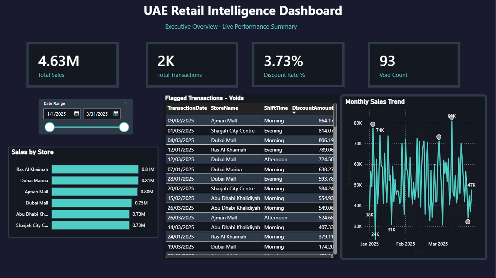
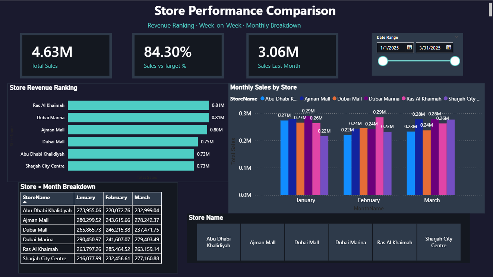
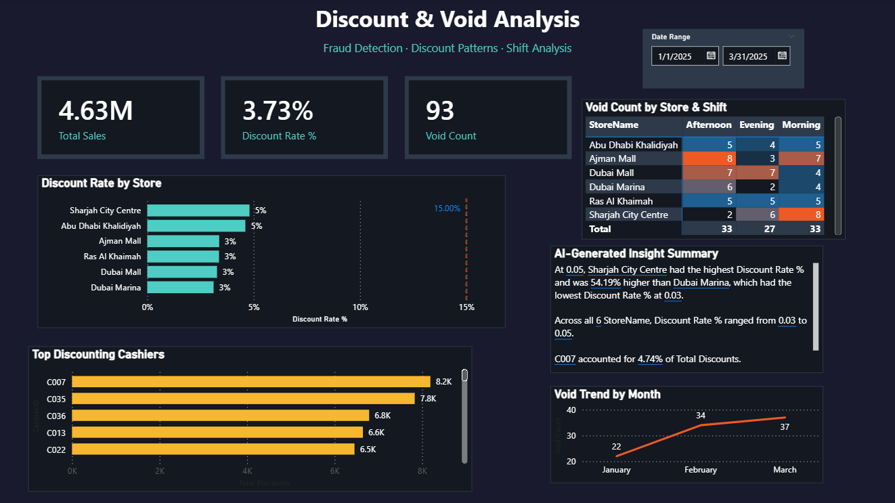
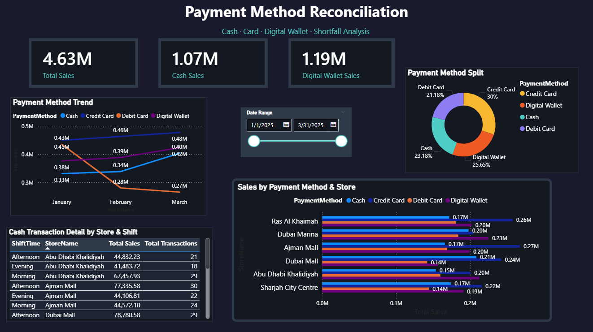
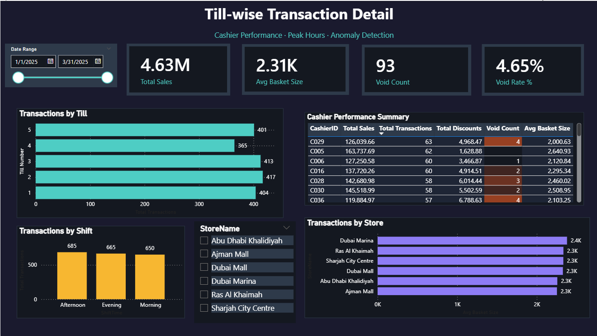

# UAE Retail Intelligence Dashboard

A 5-page Power BI dashboard built for a simulated multi-store UAE retail 
chain, designed to replace manual fragmented daily reporting with a single 
live view covering sales performance, fraud detection, payment 
reconciliation, and cashier-level accountability.

**Watch the full walkthrough:** Coming soon

**GitHub:** https://github.com/arshiaash/uae-retail-intelligence-dashboard

## The problem this solves

Multi-store retail operations in the UAE typically rely on store managers 
submitting sales data through email, WhatsApp, and manually updated 
spreadsheets — creating a 12–24 hour lag between business events and 
management awareness. This delay means discount abuse, till errors, and 
underperforming shifts go undetected until the weekly review cycle.

This dashboard consolidates that fragmented process into one live system 
covering 6 UAE store locations: Dubai Marina, Dubai Mall, Abu Dhabi 
Khalidiyah, Sharjah City Centre, Ajman Mall, Ras Al Khaimah.

---

## Pages

### Page 1 — Executive Overview
Top-level KPIs (total sales, transactions, discount rate, void count), 
store performance ranking, a flagged voided-transactions table, and a 
daily sales trend with Power BI's native anomaly detection enabled.



---

### Page 2 — Store Performance Comparison
Revenue ranking across all 6 stores, a month-by-month Sales vs Target 
measure comparing actual performance against each store's monthly revenue 
goal, and a store × month breakdown matrix.



---

### Page 3 — Discount & Void Analysis
The fraud-detection page. Discount rate by store plotted against a 15% 
abuse threshold, a void count matrix by store and shift with conditional 
colour formatting, an AI-generated insight summary using Power BI's Smart 
Narrative feature, and a void trend chart showing month-over-month 
escalation.



---

### Page 4 — Payment Method Reconciliation
Payment method split across cash, credit card, debit card, and digital 
wallet. A cash transaction detail table built for end-of-shift till 
reconciliation, and a trend chart showing payment method behaviour 
shifting month over month.



---

### Page 5 — Till-wise Transaction Detail
Cashier-level performance table with conditional formatting flagging high 
void counts in red, till transaction volume, shift peak analysis, and 
average basket size by store.



---

## How it is built

| Component | Detail |
|-----------|--------|
| Data model | Star schema — one fact table (UAE_Retail_Transactions, 2,000 rows) and two dimension tables (StoreTargets, DateTable) |
| Relationships | StoreID → StoreID (Many to One), TransactionDate → Date (Many to One) |
| DAX measures | 9 measures: Total Sales, Total Transactions, Total Discounts, Discount Rate %, Void Count, Sales Last Month, Sales vs Target %, Cash Sales, Digital Wallet Sales, Avg Basket Size, Void Rate % |
| Time intelligence | Sales Last Month using CALCULATE + DATEADD |
| AI features | Smart Narrative (automated insight generation), Anomaly Detection on trend chart |
| Data | Synthetic dataset generated via Mockaroo simulating UAE retail patterns |

---

## DAX measures reference

```dax
Total Sales = SUM(UAE_Retail_Transactions[SaleAmount])

Total Transactions = COUNTROWS(UAE_Retail_Transactions)

Discount Rate % = DIVIDE([Total Discounts], [Total Sales], 0)

Void Count = COUNTROWS(
    FILTER(UAE_Retail_Transactions, 
    UAE_Retail_Transactions[IsVoid] = TRUE()))

Sales Last Month = CALCULATE(
    [Total Sales], 
    DATEADD(DateTable[Date], -1, MONTH))

Sales vs Target % = DIVIDE(
    [Total Sales], 
    SUM(StoreTargets[MonthlyTargetAED]) * 3, 
    0)

Avg Basket Size = DIVIDE([Total Sales], [Total Transactions], 0)

Void Rate % = DIVIDE([Void Count], [Total Transactions], 0)
```

---

## Tools used

Power BI Desktop, DAX, Mockaroo (data generation), Microsoft Excel

---

## Files in this repo

| File | Description |
|------|-------------|
| `UAE_Retail_Dashboard.pbix` | Full Power BI file — open in Power BI Desktop to explore |
| `data/UAE_Retail_Transactions.csv` | 2,000-row transactions dataset |
| `data/StoreTargets.xlsx` | Monthly revenue targets per store |
| `screenshots/` | Static page previews |

---


## About

Built by Arshia Ashok, a Computer Science graduate based in Bengaluru, India.

I built this project to develop hands-on Power BI skills — starting from 
zero knowledge of DAX and data modelling, and building a complete 5-page 
dashboard with AI integration over several weeks.

My background includes Oracle APEX, Oracle Integration Cloud, and frontend 
development. I am currently upskilling in Power BI and AI automation tools 
(n8n, Make.com), and hold the Google Data Analytics Certificate with the 
Google Project Management Certificate in progress.

I am actively looking for Data Analyst, Business Analyst, Operations 
Analyst, and AI Operations roles — remote or hybrid, primarily targeting 
the UAE market, and open to global opportunities.

Connect on LinkedIn: https://www.linkedin.com/in/arshia-ashok
